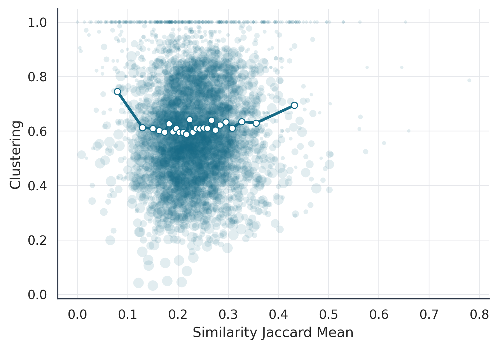
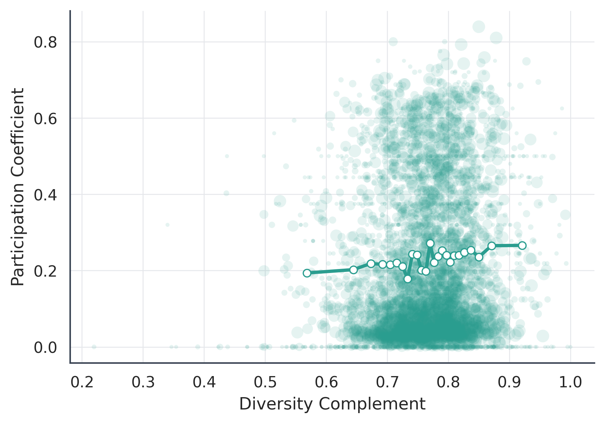
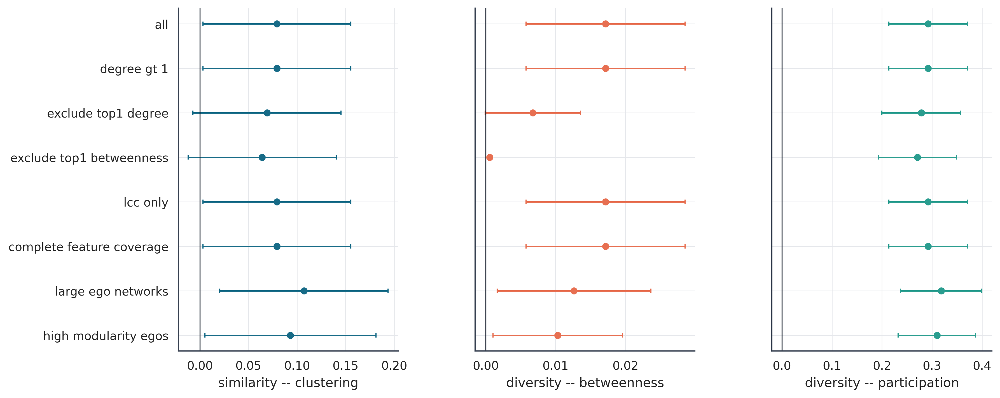

# Social Similarity, Cohesion, and Brokerage in Facebook Ego-Networks

[](https://www.python.org/)
[](https://dvc.org/)
[](.github/workflows/ci.yml)
[](tests/)
[](tests/)
[](docs/results/final_audit.md)
[](docs/results/final_audit.md)
[](Report_3___MiT_Data_Analisys.pdf)
[](LICENSE)

Do socially similar contacts create cohesive local groups, while socially
diverse contacts place individuals between communities?

This repository provides a reproducible network-science analysis of ten
Facebook ego-networks from the Stanford Network Analysis Project (SNAP). It
connects two forms of social capital:

- **Bonding:** social similarity and closure within dense neighborhoods.
- **Bridging:** social diversity and brokerage across structural communities.

The project was completed as independent coursework for the **MITx
MicroMasters Program in Statistics and Data Science**, Data Analysis module.
It is not an official MIT research publication and does not imply endorsement
by MIT or Facebook.

## Table of contents

- [Key findings](#key-findings)
- [Results at a glance](#results-at-a-glance)
  - [Similarity and local cohesion](#similarity-and-local-cohesion)
  - [Diversity and cross-community participation](#diversity-and-cross-community-participation)
  - [Robustness across analytical samples](#robustness-across-analytical-samples)
- [Data and analytical sample](#data-and-analytical-sample)
- [Methods](#methods)
- [Repository structure](#repository-structure)
- [Quick start](#quick-start)
- [Command-line interface](#command-line-interface)
- [DataOps and reproducibility](#dataops-and-reproducibility)
- [Generated evidence](#generated-evidence)
- [Limitations](#limitations)
- [Citation and attribution](#citation-and-attribution)
- [Contributing](#contributing)
- [License](#license)

## Key findings

The evidence is stronger for bridging than for bonding. All adjusted models
control for `log(1 + degree)`, include ego-network fixed effects, and use HC3
robust standard errors.

| Relationship | Adjusted coefficient | Model p-value | Permutation p-value | Interpretation |
|---|---:|---:|---:|---|
| Similarity → local clustering | 0.079 | 0.041 | 0.227 | Small positive adjusted association; not distinguishable from the attribute-permutation null |
| Diversity → log betweenness | 0.017 | 0.003 | 0.017 | Positive brokerage association beyond degree and network differences |
| Diversity → participation coefficient | 0.292 | <0.001 | 0.001 | Strongest and most robust evidence for cross-community bridging |
| Diversity → communities reached | 0.624 | <0.001 | — | Diverse neighborhoods span more detected communities |

The unconditional relationships are much weaker: Spearman's rho is 0.019 for
similarity–clustering, 0.011 for diversity–betweenness, and 0.082 for
diversity–participation. Degree is strongly correlated with betweenness
(`rho = 0.676`), which is why structural controls materially change the result.

These are cross-sectional structural associations, not causal effects.

## Results at a glance

### Similarity and local cohesion



The binned relationship is shallow and non-monotonic in the raw data. The
positive coefficient appears only after accounting for degree and
ego-network-level differences, and it does not pass the corresponding
attribute-permutation test.

### Diversity and cross-community participation



Nodes with socially diverse neighborhoods distribute their relationships more
widely across detected communities. This is the clearest empirical result and
remains positive across the main sample restrictions.

### Robustness across analytical samples



The diversity–participation estimate remains positive and precise. The
diversity–betweenness result is positive but more sensitive to the most
connected nodes, while similarity–clustering is the least stable relationship.

## Data and analytical sample

The analysis uses SNAP's anonymized `ego-Facebook` dataset. Social attributes
are sparse binary vectors whose anonymized columns are specific to each
ego-network. Accordingly, similarity is calculated **within each ego-network**;
feature codes are never assumed to have the same meaning across networks.

| Sample | Ego-networks | Node–ego records | Purpose |
|---|---:|---:|---|
| Raw/structural | 10 | 4,177 | Network descriptions and structural metrics |
| Social similarity | 10 | 4,169 | Jaccard, cosine similarity, and diversity |
| Cohesion | 10 | 4,099 | Local-clustering analysis, degree at least two |
| Brokerage | 10 | 4,169 | Betweenness and inter-community measures |
| Main regressions | 10 | 4,099 | Complete analytical intersection |

The archives contain 4,039 distinct anonymized node IDs and 85,087 unique
alter–alter ties counted within ego-network. Adding the documented ego–alter
links produces 89,254 edges in the constructed graphs. All ten graphs are
connected, so no network was discarded for path analysis.

See the [sample definition](docs/results/sample_definition.md)
and the [data-governance policy](docs/data_governance.md) for details.

## Methods

1. Safely extract and validate each ego-network and its feature files.
2. Construct full undirected ego graphs and preserve ego-specific attributes.
3. Detect communities with Louvain using 20 seeds per network and select the
   highest-modularity partition.
4. Measure social similarity with edge-level Jaccard overlap and cosine
   similarity; define the primary diversity measure as `1 - mean Jaccard`.
5. Measure cohesion with local clustering, triangles, embeddedness, and Burt's
   structural-hole metrics.
6. Measure brokerage with normalized betweenness, participation coefficient,
   communities reached, within-module z-score, and effective size.
7. Estimate Spearman correlations, HC3 regressions with ego-network fixed
   effects, and a Poisson count model.
8. Run 1,000 within-network attribute permutations, 20 configuration-model
   replications per ego-network, 500 bootstrap replications, and extensive
   robustness checks.

The complete academic report is available as
[Report 3 — MITx Data Analysis](Report_3___MiT_Data_Analisys.pdf). The PDF also
contains earlier course exercises; the Facebook research project begins in its
Project section.

## Repository structure

```text
.
├── .github/workflows/       # Continuous integration
├── config/                  # Machine-readable data contracts
├── data_raw/                # Immutable DVC-tracked source archives
├── data_processed/          # Reconstructable DVC pipeline artifacts
├── docs/                    # Architecture, DataOps, governance, assets
├── notes/                   # Research design and detailed output guide
├── outputs/                 # Logs, evidence, figures, tables, report inputs
├── scripts/                 # Shell entry points for common workflows
├── src/                     # Numbered analytical stages and shared code
├── tests/                   # Unit, contract, CLI, and integration tests
├── dvc.yaml                 # Data and artifact lineage
├── project_cli.py           # Cross-platform operational CLI
├── pyproject.toml           # Package, dependencies, pytest, coverage, Ruff
└── run_project.py           # Backward-compatible full-pipeline entry point
```

More detail is available in [Architecture](docs/architecture.md) and the
[numbered-stage reference](src/README.md).

## Quick start

### 1. Create the environment

```bash
git clone <repository-url>
cd facebook-ego-network-analysis
bash scripts/bootstrap.sh
```

### 2. Restore versioned data

```bash
dvc pull  # requires a configured project remote
```

If the two source archives are already present in `data_raw/`, no pull is
required for local reproduction.

### 3. Validate and run

```bash
make validate
make pipeline
```

The publication pipeline uses 1,000 permutations and takes approximately seven
minutes on the reference development machine. For development only:

```bash
make pipeline-fast  # 200 permutations
```

### 4. Run quality checks

```bash
make lint
make test           # unit and CI-safe contract tests
make test-all       # includes current artifact integration tests
make status
```

## Command-line interface

After installation, use either `facebook-graph-analysis` or
`.venv/bin/python project_cli.py`:

```text
run [--fast]                  Run all 17 stages
stage 01..17                  Run one development stage
validate [--require-artifacts] Validate source and analytical contracts
manifest                     Write SHA-256 source-data metadata
test [--integration]         Run automated tests
status                       Show pipeline, audit, and DVC state
dvc                          Run dependency-aware DVC reproduction
```

## DataOps and reproducibility

The repository treats academic analysis as a batch data product:

- **Planning:** preregistered-style hypotheses, sample rules, and data
  contracts.
- **Development:** immutable raw data, numbered stages, fixed seeds, and shared
  configuration.
- **Automated testing:** unit tests, data contracts, artifact integration
  tests, static analysis, and GitHub Actions.
- **Research release:** Git tags, report/figures, DVC pointers, package
  versions, and a passing audit.
- **Monitoring and governance:** checksums, schema/range checks, runtime logs,
  privacy rules, and controlled data refreshes.

Read the complete [DataOps lifecycle](docs/dataops.md) and
[reproducibility guide](docs/reproducibility.md).

## Generated evidence

The most useful review entry points are:

- [Final audit](docs/results/final_audit.md)
- [Curated result snapshots](docs/results/README.md)
- [Main regressions](docs/results/regression_main.csv)
- [Permutation tests](docs/results/empirical_pvalues.csv)
- [Robustness results](docs/results/robustness_summary.csv)
- [Report-ready key numbers](docs/results/results_key_numbers.md)

Generated directories are DVC pipeline outputs and may not be present in a
fresh Git clone until `dvc pull` or `dvc repro` is run. Selected README figures
are curated under `docs/assets/` so the research summary remains visible on
GitHub.

## Limitations

- Only ten ego-networks are available; they are not representative of all
  Facebook users.
- Profile attributes are anonymized, incomplete, and not comparable at the
  value level across ego-networks.
- Friendship edges do not capture tie strength or interaction frequency.
- Some anonymized IDs appear in multiple ego-networks, creating possible
  residual dependence.
- Communities are algorithmic structural groups, not observed social labels.
- Cross-sectional data cannot separate homophily, shared context, and social
  influence or support causal claims.

## Citation and attribution

If you use this repository, cite the included [CITATION.cff](CITATION.cff).
Please also cite the source dataset:

> McAuley, J. J., & Leskovec, J. (2012). Learning to Discover Social Circles in
> Ego Networks. *Advances in Neural Information Processing Systems, 25*.

The dataset is distributed by the
[Stanford Network Analysis Project](https://snap.stanford.edu/data/ego-Facebook.html).

## Contributing

See [CONTRIBUTING.md](CONTRIBUTING.md). Changes to data, sample rules, metrics,
or inference must update tests, contracts, DVC lineage, and documentation in
the same pull request.

## License

The repository code and original documentation are available under the
[MIT License](LICENSE). The SNAP dataset and third-party materials retain their
own terms and are not relicensed by this repository.
